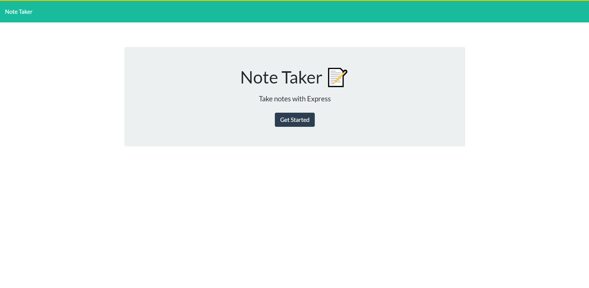
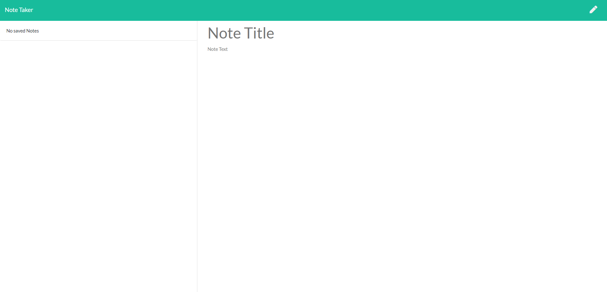

# Express_Note_Taker

## Description
* This application helps keep notes organized. Easy to use to create, modify, and delete notes. 

***

## Table of Contents

1. [Acceptance Criteria](#crit)
2. [Installation](#inst)
3. [Screenshots](#scrshot)
4. [Technology Used](#tech)
5. [License](#lice)

***
<a name="crit"></a>

## Acceptance Criteria 

```
Application should allow users to create and save notes.

Application should allow users to view previously saved notes.

Application should allow users to delete previously saved notes.
```
***
<a name="inst"></a>

## Installation
* Steps to use this repository:
1. Clone this repository and open it in VSCode.
2. Navigate to the integrated terminal.
3. Type: `npm install` into the CLI.
4. Once the packages finish downloading, simply type: `node server.js` into the CLI.
5. Type "localhost:3000" into your webbrowser once server is running.
# OR
* Visit: https://still-river-50663.herokuapp.com/

***
<a name="scrshot"></a>

## Screenshots


***

***

<a name="tech"></a>

## Technologies Used

* HTML
* JavaScript
* CSS
* jQuery
* Node.Js
   * Express
   * Path
   * Fs
   * Data parsing middleware

***
<a name="lice"></a>

## MIT License

Copyright (c) 2020 Dempsey496

Permission is hereby granted, free of charge, to any person obtaining a copy
of this software and associated documentation files (the "Software"), to deal
in the Software without restriction, including without limitation the rights
to use, copy, modify, merge, publish, distribute, sublicense, and/or sell
copies of the Software, and to permit persons to whom the Software is
furnished to do so, subject to the following conditions:

The above copyright notice and this permission notice shall be included in all
copies or substantial portions of the Software.

THE SOFTWARE IS PROVIDED "AS IS", WITHOUT WARRANTY OF ANY KIND, EXPRESS OR
IMPLIED, INCLUDING BUT NOT LIMITED TO THE WARRANTIES OF MERCHANTABILITY,
FITNESS FOR A PARTICULAR PURPOSE AND NONINFRINGEMENT. IN NO EVENT SHALL THE
AUTHORS OR COPYRIGHT HOLDERS BE LIABLE FOR ANY CLAIM, DAMAGES OR OTHER
LIABILITY, WHETHER IN AN ACTION OF CONTRACT, TORT OR OTHERWISE, ARISING FROM,
OUT OF OR IN CONNECTION WITH THE SOFTWARE OR THE USE OR OTHER DEALINGS IN THE
SOFTWARE.
